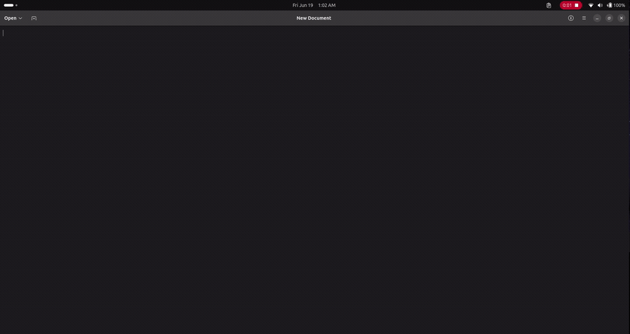
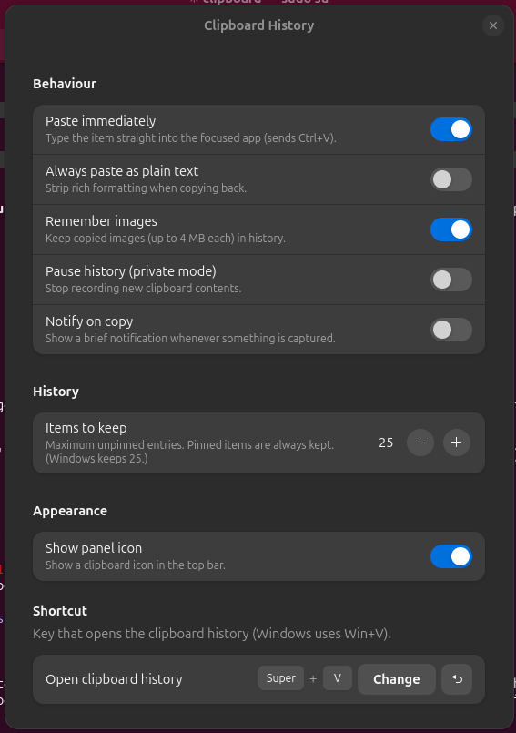

# Clipboard History

A **Windows-style clipboard history** for GNOME / Ubuntu. Press **Super + V** (the
"Windows key" + V) to open a searchable history of everything you've copied — text
and images — pin the things you reuse, and paste with a click. It's a native
replacement for the Windows 10/11 clipboard (**Win+V**).



## Features

- **Super+V** opens a searchable history popup (rebindable)
- Remembers **text and images** (PNG/JPEG/BMP/GIF…), 4 MB image cap like Windows
- **Pin** items so they survive clears and reboots
- **Click or Enter** to paste straight into the focused app (real Ctrl+V)
- **Delete** one item, or **clear all** (pinned items kept)
- History **persists across reboots**
- **Live search**, full keyboard navigation
- **Top-bar icon** for quick access to recent clips
- **Private mode** to pause recording; **password-manager opt-out** is automatic
- Configurable history size (5–500, default 25)

## Supported versions

It ships **two variants** and the installer picks the right one for your system —
GNOME hard-broke the extension API at version 45 (ES modules), so a single file
cannot load on both sides of that line.

| Ubuntu | GNOME Shell | Variant | Status |
|---|---|---|---|
| 26.04 | 50 | modern (ESM) | Developed & tested here |
| 24.04 | 46 | modern (ESM) | Supported |
| 22.04 | 42 | legacy | Supported |
| 20.04 | 3.36 | legacy | Best-effort (see note) |

Also works on other GNOME distros (Fedora, Debian, Arch…) in the same version
ranges. The legacy variant targets GNOME **3.36–44**; the modern variant targets
**45–50**.

> **Note:** Development and live testing were done on GNOME 50 (Ubuntu 26.04). The
> modern variant additionally targets 45–49, and the legacy variant 3.36–44; these
> are written against the documented APIs for those releases and degrade gracefully
> (e.g. auto-paste falls back to "copied, press Ctrl+V" if a shell lacks the
> needed API). Please file issues for any version-specific quirks.

## Install

### From source (recommended)

```bash
git clone https://github.com/jayeshbarman/clipboard-history.git
cd clipboard-history
./install.sh
```

Then **log out and log back in once** (on Wayland the shell can't hot-reload a new
extension; X11 users can instead press **Alt+F2**, type `r`, Enter). Press
**Super+V**.

### From a built zip

```bash
./build-zip.sh
gnome-extensions install --force dist/*.modern.zip   # GNOME 45+
# or .legacy.zip for GNOME 3.36–44
```

## Usage

| Action | How |
|---|---|
| Open history | **Super+V**, or the top-bar clipboard icon |
| Search | Just start typing |
| Move selection | **↑ / ↓** (PageUp/PageDown to jump) |
| Paste selected | **Enter**, or click a row |
| Pin / unpin | Click 📌 on a row |
| Delete one | Click ✕, or press **Delete** |
| Clear all (keep pinned) | "Clear all" button |
| Close | **Esc** |

## Settings

`gnome-extensions prefs clipboard-history@jayeshbarman.github.io`, or via the
top-bar icon → Settings.



- **Paste immediately** — type the item into the focused app (default on)
- **Always paste as plain text** — strip formatting
- **Remember images** — capture copied images (default on)
- **Pause history (private mode)** — stop recording temporarily
- **Notify on copy** — brief notification per capture
- **Items to keep** — 5–500 (default 25)
- **Show panel icon** — top-bar clipboard icon
- **Shortcut** — rebind from Super+V

## How it works

On modern GNOME/Wayland, the compositor deliberately blocks background programs
from reading the clipboard or injecting keystrokes, so tools like `xclip`,
`wl-paste --watch`, `wtype` and `xdotool` cannot power a clipboard manager — and
GNOME 49+ removed the X11 session entirely. The reliable approach (used by GPaste,
Pano, etc.) is to run *inside* the shell as an extension: it monitors the clipboard
via `MetaSelection`, draws the Super+V popup, and pastes through the compositor's
own Clutter virtual keyboard.

## Rebranding

Forking under your own name? One command updates the UUID and URL everywhere:

```bash
./rename.sh yourname.github.io yourname
```

## Where data lives

`~/.local/share/clipboard-history/` — `history.json` plus an `images/` folder.
Delete that folder to wipe history.

## Troubleshooting

- **Super+V does nothing:** make sure you logged out/in after install, and that the
  extension is enabled: `gnome-extensions info clipboard-history@jayeshbarman.github.io`.
  Check logs: `journalctl -f -o cat /usr/bin/gnome-shell`.
- **Super+V used to open the message tray:** the installer moved that to its other
  default (Super+M). Restore with
  `gsettings set org.gnome.shell.keybindings toggle-message-tray "['<Super>v', '<Super>m']"`.
- **Auto-paste doesn't fire in some app:** the item is still on the clipboard —
  just press Ctrl+V. You can also turn off "Paste immediately" in settings.

## Uninstall

```bash
./uninstall.sh
```

Saved history remains at `~/.local/share/clipboard-history/` (delete it to wipe).

## Contributing

Issues and PRs welcome. The codebase is small: shared `metadata.json`,
`stylesheet.css` and `schemas/`, with `src/modern/` (ESM) and `src/legacy/`
(`imports`) holding the per-API-era JavaScript.

## License

[GPL-3.0-or-later](LICENSE).
